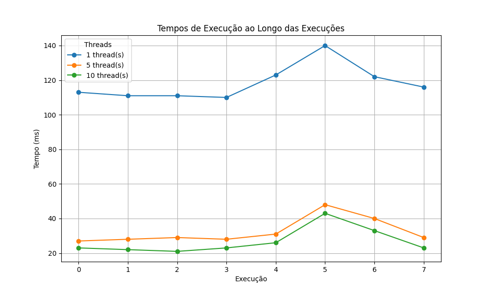

# Análise de Desempenho: Verificação de Números Primos com Threads

Este projeto implementa um programa em Java para verificar números primos em um arquivo de entrada, utilizando múltiplas threads para processamento concorrente. O objetivo é comparar o desempenho das versões com 1, 5 e 10 threads, medindo os tempos de execução e analisando a escalabilidade do programa.

---

## Estrutura do Projeto

- **Entrada01.txt**: Arquivo de entrada contendo números a serem verificados.
- **primes_1.txt**: Arquivo de saída com números primos encontrados usando 1 thread.
- **primes_5.txt**: Arquivo de saída com números primos encontrados usando 5 threads.
- **primes_10.txt**: Arquivo de saída com números primos encontrados usando 10 threads.
- **execution_times.txt**: Arquivo com os tempos de execução registrados.
- **grafico_execucao.png**: Gráfico comparativo dos tempos de execução.
- **plot_execution_times.py**: Script Python para gerar o gráfico comparativo.
- **PrimeFinder.java**: Código fonte do programa Java.

---

## Como Executar o Projeto

### Pré-requisitos
- Java Development Kit (JDK) instalado.
- Python 3 instalado (para gerar o gráfico).
- Biblioteca `matplotlib` instalada (para o script Python).

### Passos para Execução

1. **Compile o programa Java**:
   ```bash
   javac PrimeFinder.java
   ```

2. **Execute o programa Java**:
   ```bash
   java PrimeFinder
   ```

   O programa gerará os arquivos `primes_1.txt`, `primes_5.txt`, `primes_10.txt` e `execution_times.txt`.

3. **Execute o script Python para gerar o gráfico**:
   ```bash
   python plot_execution_times.py
   ```

   O script lerá os dados do arquivo `execution_times.txt` e salvará o gráfico comparativo como `grafico_execucao.png`.

4. **Visualize o gráfico**:
   Abra o arquivo `grafico_execucao.png` para visualizar o gráfico comparativo dos tempos de execução.

---

## Estratégia de Implementação

### Leitura dos Dados
- O programa lê números de um arquivo de texto (`Entrada01.txt`), onde cada linha contém um número a ser verificado.
- Os números são armazenados em uma lista juntamente com seus índices para preservar a ordem original.

### Verificação de Números Primos
- A verificação de números primos é realizada pelo método `isPrime`, que utiliza um algoritmo simples:
  - Verifica se o número é menor ou igual a 1 (não primo).
  - Verifica divisibilidade por 2 e por números ímpares até a raiz quadrada do número.

### Processamento Concorrente
- O programa utiliza a interface `Callable` e a classe `ExecutorService` para dividir o trabalho entre múltiplas threads.
- O arquivo de entrada é dividido em "chunks" (partes), e cada thread processa um chunk independentemente.
- Foram testadas versões com 1, 5 e 10 threads para avaliar o impacto do paralelismo no desempenho.

### Armazenamento dos Resultados
- Os números primos encontrados são armazenados em arquivos separados (`primes_1.txt`, `primes_5.txt`, `primes_10.txt`).
- Os tempos de execução são registrados no arquivo `execution_times.txt`, que preserva o histórico de execuções.

---

## Resultados

### Tempos de Execução Observados
Os tempos de execução foram medidos para as versões com 1, 5 e 10 threads. Abaixo estão os resultados observados em milissegundos (ms), dos 4 primeiros  testes:

| Execução | 1 Thread (ms)| 5 Threads (ms)| 10 Threads (ms) |
|----------|--------------|---------------|-----------------|
| 1        | 113          | 27            | 23              |
| 2        | 111          | 28            | 22              |
| 3        | 111          | 29            | 21              |
| 4        | 110          | 28            | 23              |

### Gráfico Comparativo
O gráfico abaixo compara os tempos de execução das versões com 1, 5 e 10 threads ao longo de várias execuções:



---

## Conclusão

A implementação do programa demonstrou que o uso de múltiplas threads pode melhorar significativamente o desempenho na verificação de números primos. No entanto, o ganho de desempenho não é linear em relação ao número de threads, pois o overhead de gerenciamento de threads começa a impactar a eficiência.

### Recomendações
- Para arquivos de entrada pequenos, o uso de 1 thread pode ser suficiente.
- Para arquivos maiores, o uso de 5 threads oferece um bom equilíbrio entre desempenho e complexidade.
- O uso de 10 threads pode ser justificado em cenários com grande volume de dados, mas o ganho de desempenho deve ser avaliado em relação ao custo adicional de recursos.

